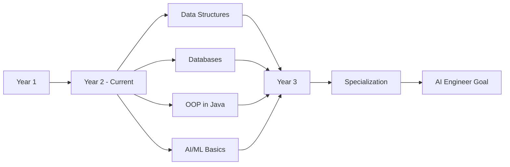

<div align="center">


<p>
  
  
  
</p>
</div>

---

## 👨‍💻 About Me


```python
class SoftwareEngineeringStudent:
    def __init__(self):
        self.name = "Mohammed Al Rashadi"
        self.role = "Software Engineering Student"
        self.university = "UTM Kuala Lumpur"
        self.year = "Year 2, Semester 3"
        self.location = "🇲🇾 Malaysia"
       
    def currently_learning(self):
        return [
            "AI & Machine Learning fundamentals",
            "Data Structures & Algorithms",
            "Database Management Systems",
            "Object-Oriented Programming"
        ]
   
    def programming_skills(self):
        return {
            "Learning": ["Python", "Java", "C++"],
            "Databases": ["MySQL", "PostgreSQL"],
            "Tools": ["Git", "VS Code", "IntelliJ"],
            "Interests": ["AI/ML", "Web Development", "Software Design"]
        }
    
    def future_goals(self):
        return "Becoming an AI/ML Engineer 🚀"
```

<br clear="right"/>

---

## 📚 What I'm Learning

<div align="center">

### 🎓 Current Semester Focus (Sem 3, Year 2)

</div>

**Core Programming Languages**
- 🐍 **Python** - Data Science, AI/ML, Scripting
- ☕ **Java** - Object-Oriented Programming, Enterprise Applications
- ⚡ **C++** - System Programming, Data Structures & Algorithms

**Database Management**
- 🗄️ **SQL** (MySQL, PostgreSQL) - Database Design & Queries
- 📊 **Database Systems** - Normalization, Transactions, Optimization

**AI & Machine Learning** (Self-Learning)
- 🤖 **Machine Learning Basics** - Supervised & Unsupervised Learning
- 📈 **Data Analysis** - NumPy, Pandas
- 🧠 **Neural Networks** - Introduction to Deep Learning

---

## 🛠️ Tech Stack

<details open>
<summary><b>💻 Programming Languages</b></summary>
<br>


</details>

<details>
<summary><b>🤖 AI/ML & Data Science (Learning)</b></summary>
<br>


</details>

<details>
<summary><b>🗄️ Databases</b></summary>
<br>


</details>

<details>
<summary><b>🔧 Tools & Platforms</b></summary>
<br>


</details>

---

## 📊 GitHub Statistics

<div align="center">
  
  
</div>

<div align="center">
  
</div>

---

## 🎯 Learning Journey



**Current Focus Areas:**
- ✅ Mastering Data Structures & Algorithms
- ✅ Building strong OOP fundamentals in Java
- ✅ Learning Database Design & SQL
- ✅ Exploring AI & Machine Learning concepts
- ✅ Practicing coding through projects

---

## 🚀 Projects & Repositories

<div align="center">

<a href="https://github.com/mohamedalrashadi/Java">
  
</a>

<a href="https://github.com/mohamedalrashadi/Python">
  
</a>

<a href="https://github.com/mohamedalrashadi/Cpp">
  
</a>

<a href="https://github.com/mohamedalrashadi/Javascript">
  
</a>

</div>

---

## 📈 Contribution Graph

<div align="center">
  
</div>

---

## 🎓 Academic Goals

<table align="center">
<tr>
<td width="50%" valign="top">

**📚 Short-term Goals**
- Master Java & OOP concepts
- Build strong database skills
- Complete DSA coursework
- Create portfolio projects
- Learn Git & version control

</td>
<td width="50%" valign="top">

**🚀 Long-term Goals**
- Specialize in AI/ML
- Contribute to open source
- Build real-world applications
- Secure internship opportunities
- Graduate with strong skills

</td>
</tr>
</table>

---

## 💡 Daily Motivation

<div align="center">
  


</div>

---

## 🤝 Let's Connect!

<div align="center">

[](https://linkedin.com/in/mohamedalrashadi)
[](https://github.com/mohamedalrashadi)
[](mailto:your.email@example.com)

<br>

### 💬 Open to:
```
📚 Study Groups    🤝 Collaboration    💡 Learning Together    🎯 Project Ideas
```

</div>

---

<div align="center">


**💡 "Every expert was once a beginner. Keep learning, keep coding!"**

<br>


<br>

⭐ **Learning in public | Building in the open | Growing every day** ⭐

</div>
